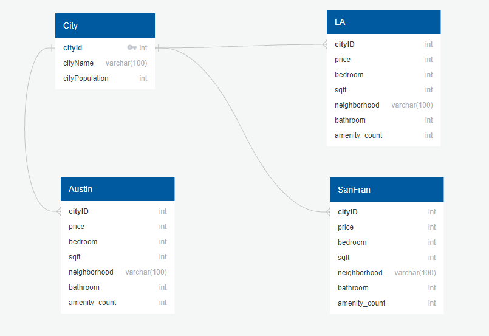
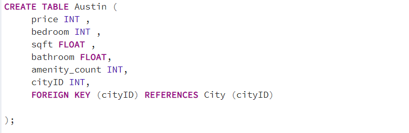

# Predicting and Analyzing Rent Prices across the United States

## Project Overview
The rental market has been reshaped by coronavirus over the past few years. With inflation surging, interest rates have sky roketed along with rent. While rental prices all across America are likely to increase over the next coming years, some cities have been impacted more than others. 

We would like to help the average american looking where to rent understand what markets are in his or her price range. We chose 9 different cities - 3 large, 3 midsize, 3 smaller across the US varing in population size based of off the United States Census Bureau. These cities vary from 300,000 population up to 4 million population. From those cities we scraped data of home listings from craigslist and pulled values such as price, number of bedrooms, sqft, bathrooms, etc. We will be using a Machine Learning Model Random Forest Regressor to Weighted Voting Regressor. 

## Questions We Hope to Answer 
* How accurately can we predict future housing prices with our machine learning model.
* How do the prices compare with the different amenities, bedroom number, sqft, location, etc?
* How does population affect the housing prices?

## Communication protocols
### Tools: 
- Slack, Zoom, Google Slides, AWS RDS

### Individual roles:

 #### Dabasebase Management / Integration:
- Pascal, Gabi, Adriana

 #### Machine Learning:
- Victor and Mark

#### Presenatation / Dashboard:
- Pascal, Gabi, Victor, Mark, Adriana 

## Tools
### Databases
* Scraping Tools: Python, Jupyter Notebook, Splinter, BeautifulSoup
* Transforming/Cleaning Tools: Pandas, JSON, Numpy, Jupyter Notebook
* Loading Tools: Jupyter notebook, pgAdmin, AWS RDS

### Machine Learning
* Random Forest Model
* Gradient Boosting Regressor
* Weighted Voting Regressor

### Tableau
* Interactive Elements:
	- Heatmap based on price and city population
	- Map of U.S. showing summary of stats and ML model accuracy etc.

## Databases

## Data Collections - ETL
### Extraction
We scraped the data of home listings across small to large size US cities from craigslist. Using "thedevastator" as sample model, we then proceeded to scrape 2022-2023 "apartments / housing for rent" data from Los Angeles, Chicago, Houston, Austin,  Boston, San Francisco, Pittsburgh, Chandler and Spokane.

- San Francisco Dataset Source -https://www.kaggle.com/datasets/thedevastator/scraping-apartments-off-of-craigslist-in-san-fra

### Transformation
We cleaned the data using pandas. We Counted the number of amenities in each listing, dropped null rows, ensured there were no duplicates, converted the data types, dropped unimportant information, and exported the cleaned data into csv files. 

### Loading
We hosted the database on AWS RDS and connected it to pgAdmin. Then created a script to create all the needed tables. After that, we loaded the clean csv data files into pgAdmin and used SQLAlchemy to create a connection string to the database. 

## Machine Learning Component

### Preprocessing:
- Use Imputer to convert NaN to usable values.

### Feature Selection:
- Drop features that are not strongly correlated with target. Maintain as much non-colinearity as possible.
- Use model-bound methods such as feature importance in Random Forest and Gradient Boosting Regressors.

### Data Split
- Default TrainTestSplit settings were applied to create an 80/20 Train/Test set for the preliminary model.

## Model 1: Random Forest Regressor
### Overview

Using a **random forest machine learning model** to predict house prices from the city datasets that were scraped.

The datasets contained the following features: 
- sqft
- beds
- amenity_count
- CityID

Our target variable is the price

### Why Use Random Forest Regression Model?

- Random forest is an ensemble of the decision trees. It can be used for both classification and regression tasks.
- Random forest helps avoid overfitting which is one of the key problems with decision tree classifiers.
- The model can handle more types of data(continuous and discrete) that other linear regression models cannot. When I previously ran a linear regression model over the same dataset it was only able to render a R squared score of 16%.
- This type of model is data hungry so the more data included the better it work. Knowing this we wanted to gather as much house listing data as possible to train the model. 

Scoring is based off negative mean squared error because we are looking for a positive score. So the more positive the number the better
The random forest model had about an 87% R squared score.

After checking how much each feature correlates to the house rental prices the results were surprising. Each feature had a very low correlation to the rent costs as shown below.

### Suggestions to Improve The Machine Learning Model

There could be more specific features that would've improved the model. In the first rough draft of the model I had used one San Francisco house prices dataset from kaggle with about 1,000 rows of data. It had more specific features than the ones we used for our final model. The kaggle data set had features like: Parking, housing type, laundry, and pets. While we had condensed those all features down to one "amenity_count" feature. The kaggle data set with the random forest model rendered an R squared score of 96%. Now this could be due to overfitting since only one city was used to train the model. Another factor that should be taken into consideration that we did not apply is the location of the house. Location as in wether the house was in a "good" area as in if its in close proximity to entertainment, major attractions, etc. We also could of used more data for each city, that would've trained the model better. The final random forest model that used all the city data that we web-scraped rendered an accuracy score of 80%. Although its not as high as the 96% of the first model it still does a decent job of predicting the **current** rent prices for the cities that were used to train the model.

### Model 2: Weighted Voting Regressor

## Summary

Several models were tested on the training data using cross validation scores with 15 folds to determine the estimated average mean squared error, the standard deviation, and a 95% confidence interval for the mean squared error for each of the 15 scores produced.

Based on these results, 8 models with the lowest mean and standard deviation of the mean squared error were selected. These models were then iterativley tuned using GridSearchCross Validation. The scores of the models were again calculated.

After fitting the best estimators, weights for the Voting Regressor were calculated by minimizing the mean squared errors for each models prediction.

Using these weights and the eight estimators, the Voting Regressor model was initialized and trained on the data. It was scored in the same manner as previous models. The r squared value for the training and testing set were then calculated.

### Data Prep

The data includes information from nine cities grouped into three population classes from different regions of the United States. The target variable was price with features: sqft, bedroom, bathroom, pop_class, cityid.

The price was heavily right tailed and a log transformation was used to create a more gaussian shape.

### Pre log Transform

### Post log Transform

The square footage data had significant outliers as shown below:

Outliers were determined on the basis of 1.5*IQR + third quartile. Lower outliers were negative. All rows containing outlier were dropped from the data.

The correlation was explored through a heatmap, showing that none of the individual features were able to explain the target.

Training and test sets were created using Stratified Shuffle Spliting to control for an equal representation of each city. The sampling error as compared to regular Train Test Split is shown in the following table:

After removing price, the target variable, the training and testing sets were scaled using a RobustScaler. This was chosen over the StandardScaler due to its robustness to outliers. Although many were already eliminated, the RobustScaler further reduced the impact of outlier values.

### Pre Tuning Models

Several regression models were evaluated. Ideally, the Voting Regressor would combine the results of several diverse models. The majority of the selected models fell into the broad categories of tree based and linear. The scores each model were stored in a Pandas DataFrame and then sorted by average mean squared error and the standard deviation. The top 8 models from the list were chosen for tuning.

### Post Tuning Models

The models were tuned using Grid Search Cross Validation and scored as before, an example from the code is shown below:

 A DataFrame was again generated from these results.

### Calculating Weights

The objective funtion to be minimized is the mean squared error (MSE):

$$Obj = {\left(1\over n \right)\sum_{i=1}^n}\left(y_i - w{y_p}^T\right)^2$$

where:
- $n$ = number of estimators
- $y$ = True value
- $w$ = vector containing the weights
- $y_p$ = matrix of predicted values

Constrained by:
$$\sum_{k=1}^n w_k = 1$$
and
$$w_k > 0$$
## Voting Regressor

The voting Regressor was constructed using the calculated weights and the 9 estimators. It was scored in the same manner and performed better than any of the individual models. 

The r squared values were then calculated.

Based on the r squared values, it appears overfitting of the training data may be occuring.

### Residual Plot

### Estimates of Each Model

## Presentation

- Link to our presentation https://docs.google.com/presentation/d/1zto2DDfDRc9m0X1drAQJ9eYMI4gCOl_0CfD11_Fj8GU/edit#slide=id.g1cb5c65843b_0_5

- Tableau: [Dashboard](https://public.tableau.com/app/profile/icycake25489/viz/PredictingCurrentHousingPricesintheUS/PredictingCurrentHousingPricesintheUS)

## Findings
* How accurately can we predict future housing prices with our machine learning model.

The image shows after plugging in the inputs that you are looking for (number of bedrooms, sqft, number of bathrooms, number of amenities) then you will get a prediction of the price of the monthly rent of the requirements you are looking for.

* How do the prices compare with the different amenities, bedroom number, sqft, location, etc?

* How does population affect the housing prices?

	
